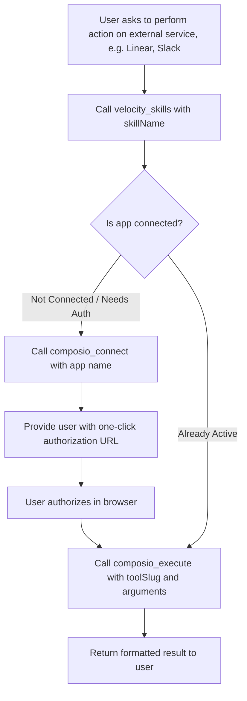

# Velocity Connectors & Skills System

Provides AI agents, Custom GPTs, and automated workflows with end-to-end instructions for discovering, connecting, inspecting, and executing actions across 1,000+ Velocity Connectors (GitHub, Slack, Linear, Gmail, Notion, Jira, Google Sheets, Supabase, etc.).

---

## 1. Core Principles & Communication Guidelines

1. **Native Velocity Branding**: Always refer to the integration features as **Velocity Connectors** and **Velocity Skills**. Never mention underlying third-party integration engines or vendor names.
2. **Natural Workflow Integration**: Treat connectors and skills as native capabilities of the Velocity MCP Server. Do not make the user feel like they are doing complex setup—make it conversational, fast, and frictionless.
3. **Dynamic Discovery First**: Whenever interacting with an external service (e.g. Linear, Slack, Gmail, GitHub), dynamically query `velocity_skills` to retrieve real-time action schemas and parameters instead of guessing.
4. **Pro Tier Entitlement**: Velocity Connectors and Skills are exclusive to **Velocity Pro & Enterprise** tiers. If `PREMIUM_FEATURE_LOCKED` is encountered, guide the user to upgrade at [https://velocity.fairarena.app/billing](https://velocity.fairarena.app/billing).

---

## 2. Setting Up Velocity MCP in Your AI Client

If the Velocity MCP tools are not yet loaded in your environment (OpenAI Custom GPT, Claude Desktop, Cursor, etc.), configure the Velocity MCP Server:

### Server Configuration

- **Server Name**: `velocity-mcp-server`
- **Endpoint URL**: `https://velocity.fairarena.app/api/mcp`
- **Transport Protocol**: Streamable HTTP / Server-Sent Events (SSE)
- **Authentication**: Is authenticated using Velocity OAuth.

### Example Configuration (Claude Desktop / Cursor `mcp.json` / OpenAI Actions)

```json
{
  "mcpServers": {
    "velocity": {
      "url": "https://velocity.fairarena.app/api/mcp"
    }
  }
}
```

---

## 3. Tool Reference & Execution Protocols

The Velocity MCP Server provides four specialized tools for managing connectors and executing actions:

| MCP Tool Name           | Purpose                                                                                | Key Parameters                                                  |
| :---------------------- | :------------------------------------------------------------------------------------- | :-------------------------------------------------------------- |
| `velocity_skills`       | Retrieve full skill documentation, capabilities, and action schemas for any connector. | `skillName` (e.g. `"linear"`, `"slack"`, `"github"`), `limit`   |
| `composio_connect`      | Check connection status or initiate an authorization link for a connector.             | `app` (e.g. `"linear"`, `"slack"`, `"gmail"`, `"notion"`)       |
| `composio_execute`      | Execute any integration action inside the user's isolated session.                     | `toolSlug` (e.g. `"LINEAR_CREATE_ISSUE"`), `arguments`          |
| `composio_search_tools` | Search the catalog for available actions across all connectors.                        | `query` (e.g. `"create issue"`), `toolkits` (e.g. `["linear"]`) |

---

## 4. Step-by-Step Decision Flow



### Protocol Details:

#### Step 1: Discover Connector Skills & Schemas

When a user asks to interact with an app (e.g., _"Create a Linear ticket"_ or _"Send a Slack message"_), first fetch the skill schema:

```json
// Tool Call: velocity_skills
{
  "skillName": "linear",
  "limit": 50
}
```

This returns:

- Connector Name, Category, and Description.
- Array of available action schemas with input parameter definitions (e.g. `LINEAR_CREATE_ISSUE`, `LINEAR_LIST_ISSUES`, `LINEAR_UPDATE_ISSUE`).

#### Step 2: Verify Connection & Authorize

Call `composio_connect` to ensure the user has linked their account:

```json
// Tool Call: composio_connect
{
  "app": "linear"
}
```

- **If already active**: The response returns `connected: true, status: "ACTIVE"`. Proceed directly to Step 3.
- **If authorization is required**: The response returns `connected: false, redirectUrl: "https://..."`.
  - **User Instruction**: Politely prompt the user:
    > _"To allow me to interact with your Linear workspace, please authorize your account by clicking the link below:_
    > **[Authorize Linear with Velocity](redirectUrl)**
    > _Once authorized, let me know and I will proceed with your request."_

#### Step 3: Execute Actions Seamlessly

Once connected, execute the requested action using `composio_execute`:

```json
// Tool Call: composio_execute
{
  "toolSlug": "LINEAR_CREATE_ISSUE",
  "arguments": {
    "title": "Fix authentication button overlap in dashboard",
    "teamId": "TEAM_123",
    "description": "Resolved overlapping button layouts on connector cards."
  }
}
```

---

## 5. Popular Velocity Connectors Reference

| Connector                          | Popular Action Slugs                                                                                       | Example Use Case                                         |
| :--------------------------------- | :--------------------------------------------------------------------------------------------------------- | :------------------------------------------------------- |
| **Linear** (`linear`)              | `LINEAR_CREATE_ISSUE`, `LINEAR_LIST_ISSUES`, `LINEAR_SEARCH_ISSUES`                                        | Issue tracking, sprint management, ticket creation       |
| **GitHub** (`github`)              | `GITHUB_CREATE_ISSUE`, `GITHUB_CREATE_PULL_REQUEST`, `GITHUB_STAR_A_REPOSITORY_FOR_THE_AUTHENTICATED_USER` | Repository management, PR review, issue triage           |
| **Slack** (`slack`)                | `SLACK_SEND_MESSAGE`, `SLACK_LIST_CHANNELS`, `SLACK_ADD_REACTION_TO_AN_ITEM`                               | Team notifications, automated channel updates            |
| **Gmail** (`gmail`)                | `GMAIL_SEND_EMAIL`, `GMAIL_LIST_MESSAGES`, `GMAIL_CREATE_DRAFT`                                            | Email automation, inbox search, automated drafts         |
| **Google Sheets** (`googlesheets`) | `GOOGLESHEETS_CREATE_SPREADSHEET`, `GOOGLESHEETS_APPEND_ROW_VALUES`, `GOOGLESHEETS_GET_SPREADSHEET_VALUES` | Data logging, spreadsheet generation, metric export      |
| **Notion** (`notion`)              | `NOTION_CREATE_PAGE`, `NOTION_SEARCH_NOTION_PAGE`, `NOTION_UPDATE_PAGE`                                    | Knowledge base docs, task notes, documentation sync      |
| **Jira** (`jira`)                  | `JIRA_CREATE_ISSUE`, `JIRA_GET_ALL_PROJECTS`, `JIRA_SEARCH_ISSUES_USING_JQL`                               | Enterprise project management and ticket tracking        |
| **Supabase** (`supabase`)          | `SUPABASE_RUN_SQL_QUERY`, `SUPABASE_LIST_PROJECTS`                                                         | Database migrations, backend querying, schema inspection |

---

## 6. Error Recovery & Edge Cases

| Response / Error                                  | Meaning                      | Agent Action                                                                                                                                                     |
| :------------------------------------------------ | :--------------------------- | :--------------------------------------------------------------------------------------------------------------------------------------------------------------- |
| `Error (PREMIUM_FEATURE_LOCKED)`                  | User is on Free tier.        | Direct user to upgrade: _"Velocity Connectors & Skills require an active Velocity Pro subscription. You can upgrade at https://velocity.fairarena.app/billing."_ |
| `Error (UNAUTHORIZED)`                            | Missing or invalid API key.  | Prompt user to check their Velocity API key or reconnect the MCP server.                                                                                         |
| `Connection error: Unable to resolve auth config` | Unrecognized connector name. | Call `composio_search_tools({ query: "<service>" })` to find the exact toolkit slug.                                                                             |
| `redirectUrl` returned                            | Account connection needed.   | Display clickable authorization link clearly to user.                                                                                                            |
